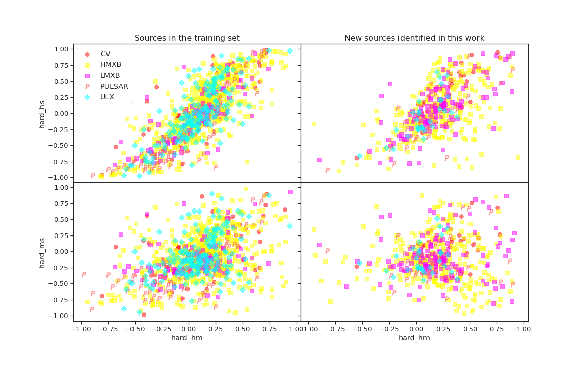
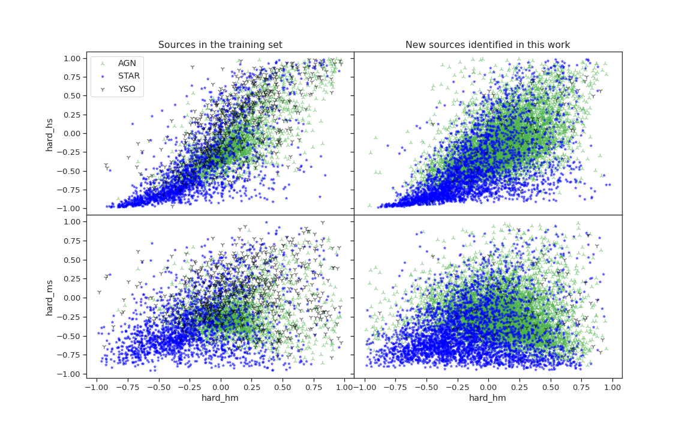
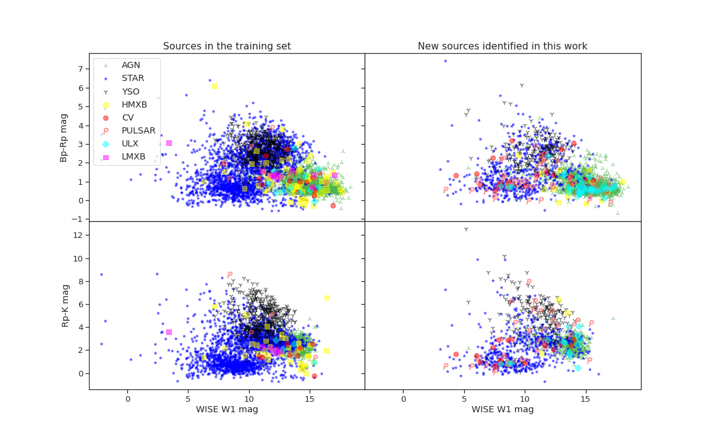

## Properties Clustering 

* Present some statistical result on clustering
* QUantify clustering using KL-Divergence

> Shows the similarity between the probability distribution

### Hardness

For Minority class

|        |     HMXB |     LMXB |      ULX |       CV |   PULSAR |
|:-------|---------:|---------:|---------:|---------:|---------:|
| HMXB   |  2.23533 |  2.48175 |  2.61658 |  1.95818 |  5.34365 |
| LMXB   |  8.67196 | 10.1265  |  9.71205 |  7.9419  | 13.1862  |
| ULX    |  8.28204 |  9.3332  |  7.34513 |  7.34864 | 13.1859  |
| CV     |  5.79033 |  6.21133 |  5.57813 |  5.60474 |  9.02974 |
| PULSAR | 11.8937  | 13.8857  | 16.1208  | 12.5379  | 21.5276  |

For majority class

|      |      AGN |    STAR |      YSO |
|:-----|---------:|--------:|---------:|
| AGN  |  3.07332 | 8.12123 | 12.1434  |
| STAR | 16.0486  | 7.96227 | 15.3298  |
| YSO  |  2.52719 | 2.13179 |  2.18784 |

### Color

>  KL-Divergence : Bp-R

For majority class

|      |       AGN |     STAR |       YSO |
|:-----|----------:|---------:|----------:|
| AGN  |  0.249757 | 4.0337   | 17.5244   |
| STAR |  4.86395  | 0.456807 |  2.81233  |
| YSO  | 19.7275   | 4.84932  |  0.773911 |

for minority classes :
*   number not significant
*   No clear clustering

|        |    HMXB |     LMXB |       ULX |      CV |    PULSAR |
|:-------|--------:|---------:|----------:|--------:|----------:|
| HMXB   | 1.54425 | -1.26911 | -1.11931  | 1.2615  |  0.603028 |
| LMXB   | 8.12381 | -3.97148 |  9.48843  | 6.44672 | 19.8401   |
| ULX    | 8.11468 | -1.8364  | -0.736477 | 4.58605 | 13.2152   |
| CV     | 1.91624 | -3.02179 |  0.90421  | 1.74362 |  2.94141  |
| PULSAR | 3.70985 | -3.29855 |  1.31311  | 3.95512 |  4.02872  |

>  KL-Divergence : Rp-K

|      |      AGN |     STAR |      YSO |
|:-----|---------:|---------:|---------:|
| AGN  | 0.523754 | 2.38744  | 6.40996  |
| STAR | 1.01854  | 0.311165 | 4.52586  |
| YSO  | 4.30314  | 5.67829  | 0.402855 |

>  KL-Divergence : W1-mag

|      |      AGN |     STAR |      YSO |
|:-----|---------:|---------:|---------:|
| AGN  | 0.118917 | 6.69044  | 1.02845  |
| STAR | 5.98973  | 0.110681 | 0.322899 |
| YSO  | 8.91246  | 1.8544   | 0.887783 |

