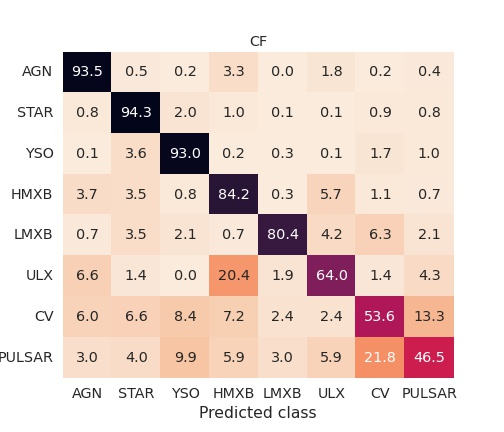
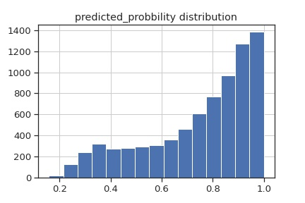
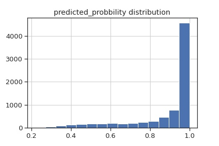
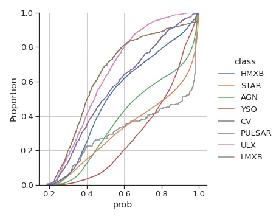

# Imputation Issue 

<table><tr>
<tr>
    <td colspan=2> Classifier used : Random forest classifier</td>
</tr>
<td>
<h3> Tuned for Mode Imputation </h3>

</td>
<td>
<h3> Tuned for Iterative Imputation </h3>

</td>
</tr></table>

## Possible explanation 

Why imputation is a vey vey bad idea -- 

Look at the plot of class-wise missing values 

The plot of missing class-wise missing values we see that the 
missing values distribution across classes are somewhat peculiar. 
Like variabilityy features are mostly availbe fox X-ray binaries
optical and UV features are available only for AGN, STAR and YSO. 
The presence or absence of feature in certain wavelength can 
itself be an identifying factor. For example, it is inherent property 
of LMXB to be undetectable in optical. and prominant in X-ray. 
Source being visible in one wavelength nd not in other wavelength is 
basically an identifying feature of the source. 
SInce we are considering the all sky survey catalogs, 
which has look through the entire sky, 
if a LMXB is not visible in GAIA, then its not the fault of GAIA, 
iths the feature of LMXB to hide itself in optical.

WHen we do mode imputation, the values ar just replaced by one values
each column like a flag. For populated cases like AGN, the fraction of 
missing values in optical/UV are relatively small compared to available value
and thus the mode values and thus have a less impact on classification.
For lexx populated class like LMXB, almost all the optical features are available ,
hence mode imputation just replaces all the values with a same value and thus acts like
a flag for missing properties in those column and actually improves their identification.

When we do regression imputation this happens we do not consider any class information At certain stage we are filling the Y feature using all other features say Xi, 
the regression basically finds a function Yi = F(Xi), 
where Xk are features other than Y.
and it find this function by using vales of other function
It finds only one function that fits all the source. Now the problematic part is that
for different class this function may be different. For example , the relation betwee UV and X-ray 
property of 

# Moving from RandomForest to Gradient Boost RF

<table>
<tr>
    <td> <h2>RF classifier </h2></td>
    <td> <h2>GB CLassifier</h2> </td>
</tr>
<tr>
    <td colspan=2> <h3> Confusion matrix </h3></td>
</tr>
<tr>
    <td>
    
    </td>
    <td>
    
    </td>
</tr>
<tr>
    <td colspan=2> <h3> Predicted Probabilities Histogram </h3></td>
</tr>
<tr>
    <td>
    
    </td>
    <td>
    
    </td>
</tr>
<tr>
    <td>
    
    </td>
    <td>
    
    </td>
</tr>
</table>

# Gradient Boost to LightGBM

> Histogram Based Gradient Boost

> Can Handle missing values

No need for Imputation 
But we have class imbalance
Earlier case once we imputed, we could use **SMOTE** for upsampling of minority class, but here with missing values we can not use SMOTE. Workaround
*   Use Class weight : 
    $w_i = \frac{\sum n_i}{n_i^\gamma}$ 
    *   Gamma becmes one of the hyper-parameters  
*   Focal Loss

<table>
<tr>
    <td> <h2>GB CLassifier</h2> </td>
    <td> <h2>LightGBM CLassifier</h2> </td>
</tr>
<tr>
    <td colspan=2> <h3> Confusion matrix </h3></td>
</tr>
<tr>
    <td>
    
    </td>
    <td>
    
    </td>
</tr>
<tr>
    <td colspan=2> <h3> Predicted Probabilities Histogram </h3></td>
</tr>
<tr>
    <td>
    
    </td>
    <td>
    
    </td>
</tr>
<tr>
    <td></td>
    <td></td>
</tr>
</table>

# Overall Result 

| Classifier |  Accuracy    |Precision |  Recall    |   f1 score     |
|:------|----------:|----------:|----------:|----------:|
| RF    | 89    |   0.90    |   0.89    |   0.90    |
| GB    |   89  |   0.91    |   0.89    |   0.90    |
| LightGBM  | 93    |   0.931    |  0.93    |   0.93    |    

# Confident New sources 

probability threshold = 0.9 

> Number of sources : 39893

| Class |  LighbGBM |  GB       |   RF      |
|:------|----------:|----------:|----------:|
| AGN   |   7371    |   3624    |   1       |
| STAR  |   7745    |   4921    |   1095    |
|YSO    |   6069    |   2611    |   1       |
|HMXB   |   1675    |   574     |   272     |
|LMXB   |   151     |   88      |   5       |
|ULX    |   760     |   15      |   0       |
|CV     |   555     |   48      |   7       |
|PULSAR |   419     |   48      |   0       |
|**Total** | 24745  |   11929   |   1375    |

