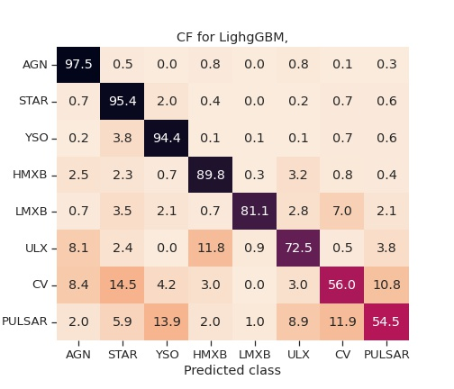

# Imputation Issue 

<table><tr>
<tr>
    <td colspan=2> Classifier used : Random forest classifier</td>
</tr>
<td>
<h3> Tuned for Mode Imputation </h3>

</td>
<td>
<h3> Tuned for Iterative Imputation </h3>

</td>
</tr></table>

# Moving from RandomForest to Gradient Boost RF

<table>
<tr>
    <td> <h2>RF classifier </h2></td>
    <td> <h2>GB CLassifier</h2> </td>
</tr>
<tr>
    <td colspan=2> <h3> Confusion matrix </h3></td>
</tr>
<tr>
    <td>
    
    </td>
    <td>
    
    </td>
</tr>
<tr>
    <td colspan=2> <h3> Predicted Probabilities Histogram </h3></td>
</tr>
<tr>
    <td>
    
    </td>
    <td>
    
    </td>
</tr>
<tr>
    <td>
    
    </td>
    <td>
    
    </td>
</tr>
</table>

# Gradient Boost to LightGBM

> Histogram Based Gradient Boost

> Can Handle missing values

No need for Imputation 
But we have class imbalance
Earlier case once we imputed, we could use **SMOTE** for upsampling of minority class, but here with missing values we can not use SMOTE. Workaround
*   Use Class weight : 
    $w_i = \frac{\sum n_i}{n_i^\gamma}$ 
    *   Gamma becmes one of the hyper-parameters  
*   Focal Loss

<table>
<tr>
    <td> <h2>GB CLassifier</h2> </td>
    <td> <h2>LightGBM CLassifier</h2> </td>
</tr>
<tr>
    <td colspan=2> <h3> Confusion matrix </h3></td>
</tr>
<tr>
    <td>
    
    </td>
    <td>
    
    </td>
</tr>
<tr>
    <td colspan=2> <h3> Predicted Probabilities Histogram </h3></td>
</tr>
<tr>
    <td>
    
    </td>
    <td>
    
    </td>
</tr>
<tr>
    <td></td>
    <td></td>
</tr>
</table>

# Overall Result 

| Classifier |  Accuracy    |Precision |  Recall    |   f1 score     |
|:------|----------:|----------:|----------:|----------:|
| RF    | 89    |   0.90    |   0.89    |   0.90    |
| GB    |   89  |   0.91    |   0.89    |   0.90    |
| LightGBM  | 93    |   0.931    |  0.93    |   0.93    |    

# Confident New sources 

> Number of sources : 39893

| Class |  LighbGBM |  GB       |   RF      |
|:------|----------:|----------:|----------:|
| AGN   |   7371    |   3624    |   1       |
| STAR  |   7745    |   4921    |   1095    |
|YSO    |   6069    |   2611    |   1       |
|HMXB   |   1675    |   574     |   272     |
|LMXB   |   151     |   88      |   5       |
|ULX    |   760     |   15      |   0       |
|CV     |   555     |   48      |   7       |
|PULSAR |   419     |   48      |   0       |
|**Total** | 24745  |   11929   |   1375    |

