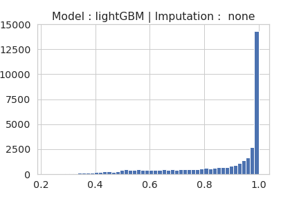

# Issues 

*   Number of sources dispropotinate for the case of Random Forest
*   Class balance $\gamma$ factor tuning 
*   Why GB is has very high preoformance gain compared to random forest ?
*   How LightGBM is handling Missing values.

# Number of sources Issue

> Probability threshold should not be chosen same for different models\
> Different models have different confidance levels.

<table>
<tr><th>RF</th><th>GB</th><th>LightGBM</th></tr>
<tr><td colspan=3>Unidentified sources probability distribution - classwise</td></tr>
<tr>
    <td></td>
    <td></td>
    <td></td>
</tr>
<tr><td colspan=3>Unidentified sources probability distribution</td></tr>
<tr>
    <td></td>
    <td></td>
    <td></td>
</tr>
<tr><td colspan=3>Unidentified sources classification numbers</td></tr>
<tr>
<td>   

| class   |   Argmax |   0.5 |   0.9 |
|:--------|---------:|------:|------:|
| AGN     |    10500 |  5692 |     4 |
| YSO     |    10450 |  6372 |     2 |
| STAR    |    10024 |  6868 |  1122 |
| HMXB    |     6867 |  2088 |   276 |
| ULX     |      963 |   118 |   nan |
| CV      |      715 |    50 |     7 |
| PULSAR  |      214 |    12 |   nan |
| LMXB    |      160 |    82 |     7 |

<td>

| class   |   Argmax |   0.5 |   0.9 |
|:--------|---------:|------:|------:|
| STAR    |    11844 |  8965 |  4911 |
| AGN     |    11674 |  8391 |  3645 |
| YSO     |     8934 |  8105 |  2591 |
| HMXB    |     4364 |  2268 |   569 |
| ULX     |     1321 |   491 |    15 |
| CV      |      948 |   488 |    48 |
| PULSAR  |      594 |   162 |    17 |
| LMXB    |      214 |   161 |    88 |

</td>
<td>

| class   |   Argmax |   0.5 |   0.9 |
|:--------|---------:|------:|------:|
| YSO     |     8972 |  8344 |  6663 |
| AGN     |     8926 |  7114 |  4771 |
| STAR    |     8551 |  7210 |  5572 |
| ULX     |     3436 |  2267 |  1085 |
| CV      |     3288 |  1612 |   653 |
| PULSAR  |     3243 |  2335 |  1437 |
| HMXB    |     3192 |  2192 |  1411 |
| LMXB    |      285 |   195 |   146 |

</td>

</tr>
</table>

# How Gradient Boost does the magic to improve RF

[Simple Video Explanation](https://www.youtube.com/watch?v=TyvYZ26alZs)

It is because of the way the trees are build in both the cases.

In RF Decision trees are built which are independednt of each other and the outputs are combined in parallel

For Gradient Boosted Trees, the trees are built sequentially. With a given loss function the loss at each newly constructed tree is built. The gradient of this loss function at $m-1^{th}$ tree is used to construct a new tree. This new tree is combined to the previous trees after multiplying ith a weight factor called Learning rate $\eta$, which generally varies from 0 to 1 

> Intitively new tree is built to minimize the error from the previous tree.

For clasification, generally categorical cross entropy is chosen as the loss function.

$Loss (p,q) = \sum p(x)\times Log(q(x))$

$F(2) = F(1)\times Second\ Tree$

$Second\ Tree = -\frac{\partial L}{\partial F(1)} = - \frac{\partial Loss}{\partial Previous\ Model \ Output}$

In general 

Output at the end of tree m is 

$F(m) = F(m-1)+\eta \times -\frac{\partial L}{\partial F(m-1)}$

Compared to Random Forest, Gradient Boosted trees can learn more complex decision boundaries.

# $\gamma$ tuning for LightGBM class imbalance

# How LightGBM improves GB

*   Creates Histogram and uses the binned values
*   A decision on which side to go for a given exmple, in the case of missing feature is decided by the side of maximum gain.
*   More flexible hyper parameter tuning
*   More details in the paper, still trying to understand.