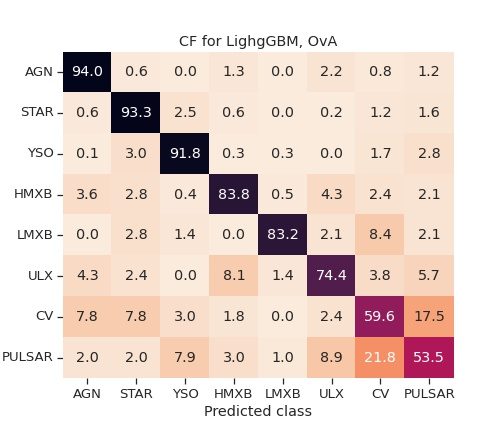
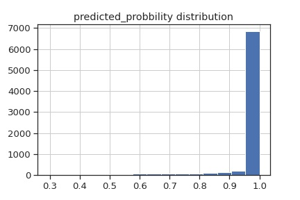

# LightGBM-OVA
## Confusion matrix


<table><tr>
<td>

</td>
<td></td>
</tr></table>


## Scores 


<table><tr>
<td>

| class   |   recall_score |   precision_score |   f1_score |
|:--------|---------------:|------------------:|-----------:|
| AGN     |       0.939875 |          0.969841 |   0.954623 |
| CV      |       0.596386 |          0.428571 |   0.498741 |
| HMXB    |       0.838235 |          0.891892 |   0.864232 |
| LMXB    |       0.832168 |          0.915385 |   0.871795 |
| PULSAR  |       0.534653 |          0.247706 |   0.338558 |
| STAR    |       0.932616 |          0.965492 |   0.948769 |
| ULX     |       0.744076 |          0.596958 |   0.662447 |
| YSO     |       0.91819  |          0.923818 |   0.920995 |
</td>
<td>
    <ul>
        <li> Accuracy - 
        <li> Precision - 
        <li> Recall - 
    </ul>
</td>
</tr></table>


## On unidentified dataset 

> Number of sources : 39893

<table><tr>
<td>

|Class   |Number of sources|
|:-------|--------:|
| STAR   |    6298 |
| AGN    |    4985 |
| YSO    |    2347 |
| CV     |    1177 |
| HMXB   |    1167 |
| PULSAR |    1133 |
| ULX    |     978 |
| LMXB   |     127 |
</td>
<td></td>
</tr></table>


# LightGBM-Multiclass
## Confusion matrix


<table><tr>
<td>

</td>
<td></td>
</tr></table>


## Scores 


<table><tr>
<td>

| class   |   recall_score |   precision_score |   f1_score |
|:--------|---------------:|------------------:|-----------:|
| AGN     |       0.974948 |          0.969282 |   0.972107 |
| CV      |       0.560241 |          0.607843 |   0.583072 |
| HMXB    |       0.898396 |          0.915531 |   0.906883 |
| LMXB    |       0.811189 |          0.943089 |   0.87218  |
| PULSAR  |       0.544554 |          0.466102 |   0.502283 |
| STAR    |       0.95448  |          0.95964  |   0.957053 |
| ULX     |       0.725118 |          0.689189 |   0.706697 |
| YSO     |       0.944299 |          0.928144 |   0.936152 |
</td>
<td>
    <ul>
        <li> Accuracy - 
        <li> Precision - 
        <li> Recall - 
    </ul>
</td>
</tr></table>


## On unidentified dataset 

> Number of sources : 39893

<table><tr>
<td>

|        |   class |
|:-------|--------:|
| STAR   |    7745 |
| AGN    |    7371 |
| YSO    |    6069 |
| HMXB   |    1675 |
| ULX    |     760 |
| CV     |     555 |
| PULSAR |     419 |
| LMXB   |     151 |
</td>
<td></td>
</tr></table>


# GB
## Confusion matrix


<table><tr>
<td>

</td>
<td></td>
</tr></table>


## Scores 


<table><tr>
<td>

| class   |   recall_score |   precision_score |   f1_score |
|:--------|---------------:|------------------:|-----------:|
| AGN     |       0.896451 |          0.978578 |   0.935716 |
| CV      |       0.584337 |          0.40249  |   0.476658 |
| HMXB    |       0.874332 |          0.841699 |   0.857705 |
| LMXB    |       0.804196 |          0.793103 |   0.798611 |
| PULSAR  |       0.594059 |          0.28436  |   0.384615 |
| STAR    |       0.912545 |          0.972127 |   0.941394 |
| ULX     |       0.744076 |          0.468657 |   0.575092 |
| YSO     |       0.935596 |          0.910246 |   0.922747 |
</td>
<td>
    <ul>
        <li> Accuracy - 0.889
        <li> Precision - 0.91
        <li> Recall - 0.89
        <li> f1 score - 0.90
    </ul>
</td>
</tr></table>


## On unidentified dataset 

> Number of sources : 39893

<table><tr>
<td>

|   Class     |   Number of sources |
|:-------|--------:|
| STAR   |    4921 |
| AGN    |    3624 |
| YSO    |    2611 |
| HMXB   |     574 |
| LMXB   |      88 |
| PULSAR |      48 |
| CV     |      48 |
| ULX    |      15 |
</td>
<td></td>
</tr></table>


# RF Moode Tuned
## Confusion matrix

<table><tr>
<td>

</td>
<td></td>
</tr></table>

## Scores 

<table><tr>
<td>

| class   |   recall_score |   precision_score |   f1_score |
|:--------|---------------:|------------------:|-----------:|
| AGN     |       0.931942 |          0.966234 |   0.948778 |
| CV      |       0.506024 |          0.48     |   0.492669 |
| HMXB    |       0.824866 |          0.801299 |   0.812912 |
| LMXB    |       0.811189 |          0.852941 |   0.831541 |
| PULSAR  |       0.50495  |          0.31677  |   0.389313 |
| STAR    |       0.937993 |          0.96072  |   0.94922  |
| ULX     |       0.630332 |          0.507634 |   0.562368 |
| YSO     |       0.923412 |          0.91073  |   0.917027 |
</td>
<td>
    <ul>
        <li> Accuracy - 0.89
        <li> Precision - 0.90
        <li> Recall - 0.89
        <li> f1 score - 0.90
    </ul>
</td>
</tr></table>


## On unidentified dataset 

> Number of sources : 39893

<table><tr>
<td>

|   Class     |   Number of sources |
|:-------|--------:|
| STAR |    1095 |
| HMXB |     272 |
| CV   |       7 |
| LMXB |       5 |
| YSO  |       1 |
| AGN  |       1 |
</td>
<td></td>
</tr></table>


# RF rfimp Tuned
## Confusion matrix

<table><tr>
<td>

</td>
<td></td>
</tr></table>

## Scores 

<table><tr>
<td>

| class   |   recall_score |   precision_score |   f1_score |
|:--------|---------------:|------------------:|-----------:|
| AGN     |       0.924008 |          0.953879 |   0.938706 |
| CV      |       0.518072 |          0.457447 |   0.485876 |
| HMXB    |       0.791444 |          0.766839 |   0.778947 |
| LMXB    |       0.776224 |          0.925    |   0.844106 |
| PULSAR  |       0.415842 |          0.330709 |   0.368421 |
| STAR    |       0.937276 |          0.952988 |   0.945067 |
| ULX     |       0.540284 |          0.445312 |   0.488223 |
| YSO     |       0.926023 |          0.904762 |   0.915269 |
</td>
<td>
    <ul>
        <li> Accuracy - 0.89
        <li> Precision - 0.89
        <li> Recall - 0.89
        <li> f1 score - 0.89
    </ul>
</td>
</tr></table>


## On unidentified dataset 

> Number of sources : 39893

<table><tr>
<td>

|   Class     |   Number of sources |
|:-------|--------:|
| AGN  |    3310 |
| STAR |     118 |
</td>
<td></td>
</tr></table>


# LightGBM classification Results 
### Model 
```
LGBMClassifier(class_weight={'AGN': 1.3356883328329183, 'CV': 64.70085628321034,
                             'HMXB': 2.527906031090322,
                             'LMXB': 129.63681917019255,
                             'PULSAR': 940.7398749439147,
                             'STAR': 1.2820594649453247,
                             'ULX': 26.616689970780907,
                             'YSO': 1.8284347681624522},
               force_col_wise=True, is_unbalance=True, metric=['auc_mu'],
               num_class=8, objective='multiclassova', random_state=42,
               sparse=True, verbosity=0)
One vs all 
with class weight -  w = np.exp((l / val)*0.09)
```
## Scores 

| class   |   recall_score |   precision_score |   f1_score |
|:--------|---------------:|------------------:|-----------:|
| AGN     |       0.956576 |          0.975724 |   0.966055 |
| CV      |       0.560241 |          0.481865 |   0.518106 |
| HMXB    |       0.877005 |          0.914923 |   0.895563 |
| LMXB    |       0.818182 |          0.92126  |   0.866667 |
| PULSAR  |       0.544554 |          0.307263 |   0.392857 |
| STAR    |       0.942652 |          0.969764 |   0.956016 |
| ULX     |       0.767773 |          0.611321 |   0.680672 |
| YSO     |       0.941688 |          0.931153 |   0.936391 |

## On Non-variable sources

| class   |   Argmax |   Most probable > 0.98 |   0.5 |   0.6 |   0.7 |   0.8 |   0.9 |   0.98 |
|:--------|---------:|-----------------------:|------:|------:|------:|------:|------:|-------:|
| AGN     |    66390 |                  25279 | 54354 | 51796 | 48725 | 44733 | 37909 |  25282 |
| PULSAR  |    39429 |                  11727 | 29821 | 27951 | 25780 | 23150 | 19247 |  11732 |
| STAR    |    34400 |                  13332 | 26788 | 25369 | 23942 | 22220 | 19500 |  13334 |
| ULX     |    33199 |                   4428 | 22497 | 20412 | 18024 | 15101 | 10975 |   4430 |
| HMXB    |    27362 |                   7095 | 19093 | 17766 | 16343 | 14557 | 11858 |   7096 |
| CV      |    17929 |                   1283 |  8162 |  7062 |  5758 |  4588 |  3099 |   1283 |
| YSO     |    17889 |                   5111 | 14208 | 13197 | 12006 | 10597 |  8421 |   5111 |
| LMXB    |      578 |                    151 |   345 |   332 |   313 |   186 |   169 |    151 |


now let us have a look on their distribution : 


Is it that galactic coordinates are playing way too much role? can we obtain almost similar distribution without galactic coordinates?

### After dropping galactic coordinates

| class   |   recall_score |   precision_score |   f1_score |
|:--------|---------------:|------------------:|-----------:|
| AGN     |       0.901879 |          0.957447 |   0.928833 |
| CV      |       0.415663 |          0.285124 |   0.338235 |
| HMXB    |       0.574866 |          0.659509 |   0.614286 |
| LMXB    |       0.58042  |          0.419192 |   0.486804 |
| PULSAR  |       0.425743 |          0.177686 |   0.250729 |
| STAR    |       0.88853  |          0.935825 |   0.911565 |
| ULX     |       0.578199 |          0.398693 |   0.471954 |
| YSO     |       0.830287 |          0.823834 |   0.827048 |


| class   |   Argmax |   Most probable > 0.98 |   0.5 |   0.6 |   0.7 |   0.8 |   0.9 |   0.98 |
|:--------|---------:|-----------------------:|------:|------:|------:|------:|------:|-------:|
| HMXB    |    47093 |                  10029 | 35725 | 32715 | 29372 | 25448 | 20010 |  10046 |
| AGN     |    47015 |                  25057 | 42394 | 40549 | 37958 | 34547 | 29591 |  25062 |
| PULSAR  |    38795 |                  10348 | 33196 | 31229 | 28664 | 25341 | 20089 |  10364 |
| STAR    |    37955 |                  17099 | 33514 | 32073 | 30355 | 28056 | 24445 |  17112 |
| ULX     |    31791 |                   4911 | 26787 | 24916 | 22487 | 18906 | 13449 |   4919 |
| YSO     |    13324 |                   3704 | 11502 | 10900 | 10102 |  8868 |  7039 |   3710 |
| LMXB    |    12094 |                   1895 |  9149 |  8317 |  7273 |  5999 |  4394 |   1903 |
| CV      |     9109 |                    401 |  6341 |  5554 |  4661 |  3511 |  1968 |    401 |


