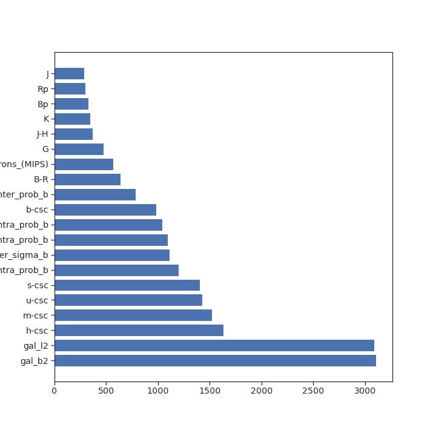
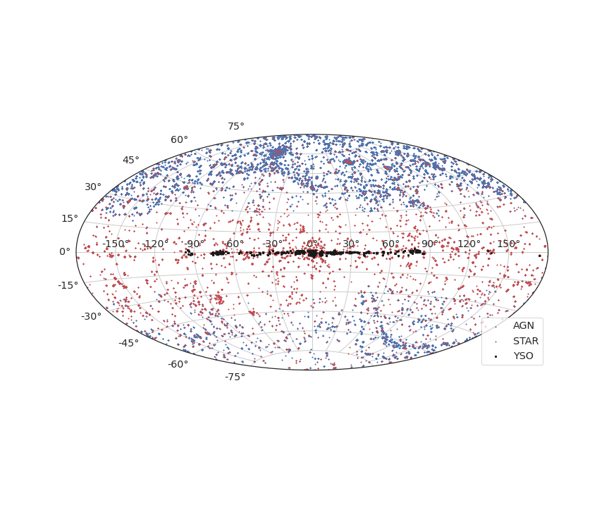

# Confident sources

*   total number of sources above $3\sigma$ : 54770
*   Number of AGN

| class |  number |
|:-------|--------:|
| AGN    |   32600 |
| STAR   |   16148 |
| YSO    |    5184 |
| HMXB   |     439 |
| LMXB   |     197 |
| CV     |      89 |
| PULSAR |      63 |
| ULX    |      50 |

